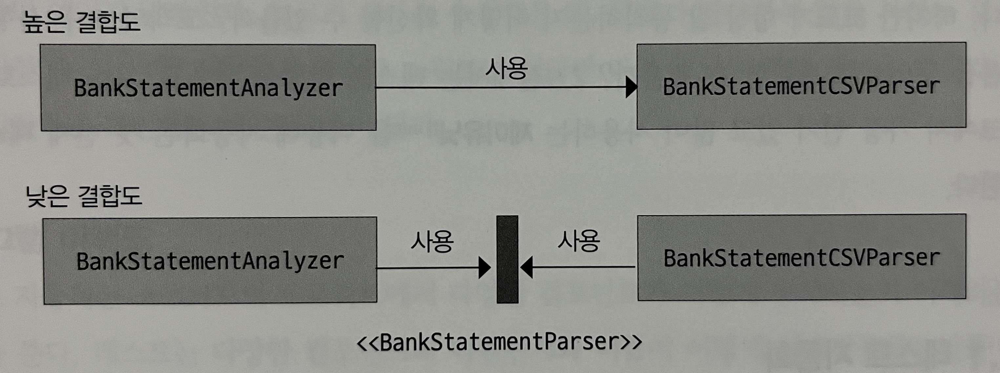

## 2장 정리

### ✔️ SRP (단일 책임 원칙)
- SOLID 원칙 중 하나
- 클래스는 단 하나의 책임을 가져야 함
- 클래스가 바뀌어야 하는 이유는 오직 하나 (로버트 마틴)

### ✔️ KISS 원칙
- Keep it small and simple 의 약어
- 간단하고 알기 쉽게 만드는 편이 좋다는 원칙

### ✔️ final 변수
- final 로 정의하게 되면 값을 재할당 할 수 없다

### ✔️ 코드 유지보수성이란
    1️⃣ : 특정 기능의 코드를 쉽게 찾을 수 있어야 함
    2️⃣ : 코드가 어떤 일을 수행하는지 쉽게 이해할 수 있어야 함
    3️⃣ : 새로운 기능의 추가 또는 기존 코드의 제거가 쉬어야 함
    4️⃣ : 캡슐화가 잘 되어 있어야 함

### ✔️ 안티 패턴이란?
- 한 개의 거대한 god class 때문에 이해하기 어려움
- 코드 중복 때문에 불안정하고 변화에 쉽게 망가짐
  - 갓 클래스 - 하나의 클래스에  모여있어 코드찾기가 쉽지 않다
  - 코드 중복 - 기존 기능 수정이 어려움, 다 바꿔야 함

### ✔️ 놀람 최소화 원칙
- principle of least surprise
- 메소드가 수행하는 일을 바로 알 수 있게 자체 문서화를 제공하는 메소드명을 사용
- 코드가 파라미터 상태에 따라 의존할 수 있으므로 파라미터의 상태를 바꾸지 않는다

### ✔️ 클래스 수준 응집도
- 실무에서는 일반적으로 여섯 가지 방법으로 그룹화
  1. 기능
  2. 정보
  3. 유틸리티
  4. 논리
  5. 순차
  6. 시간

### ✔️ DAO 란?
- data access object 데이터 접근 객체
- 데이터 소스로의 접근을 추상화하고 캡슐화

### ✔️ 유틸리티 클래스
- 관련성 없는 메소드를 한 클래스로 포함
- 낮은 응집도로 이어지므로 지양
- 전체 기능 추론 어려움

> BankTransactionDAO 클래스
> 
> 네 가지 책임을 가지고 있고 SRP 를 위반하게 된다

### ✔️ 다양한 응집도 수준과 장단점
| 응집도 수준      | 장점            | 단점                  |
|-------------|---------------|---------------------|
| 기능 (높은응집도)  | 이해하기 쉬움       | 너무 단순한 클래스 생성       |
| 정보 (중간응집도)  | 유지보수하기 쉬움     | 불필요한 디펜던시           |
| 순차 (중간응집도)  | 관련 동작을 찾기 쉬움  | SRP를 위반할 수 있음       |
| 논리 (중간응집도)  | 높은 수준의 카테고리화 제공 | SRP를 위반할 수 있음       |
| 유틸리티 (낮은응집도) | 간단히 추가 기능     | 클래스의 책임을 파악하기 어려움   |
| 시간 (낮은응집도)  | 판단 불가         | 각 동작을 이해하고 사용하기 어려움 |

### ✔️ 결합도
- 한 기능이 다른 클래스에 얼마나 의존하고 있는지를 가늠
- BankStatementAnalyzer 특정 구현에 종속되지 않게 리팩토링을 했다
- 높은 결합도는 무조건 피하자

### ✔️ 테스트가 중요한 이유
- 잘 동작하는지 확신을 할 수 있다
- 코드를 수정했을 때 버그를 빠르게 확인할 수 있다
- 프로젝트를 보았을 때 어떻게 동작하는지 빠르게 이해가능

### ✔️ 테스트 메소드 정의
- 테스트 클래스 접미어로 Test 붙여주는 것이 관습
- 메소드 이름은 누가봐도 어떤 테스튼지 인지 할 수 있게 정하기

### ✔️ 테스트 공식
- Given-When-Then
- 테스트의 context 를 설정
- 동작을 실행
- 예상된 결과를 assertion 지정

### 🧪 Assert ~
| 메소드 종류                                       | 용도                                       |
|----------------------------------------------|------------------------------------------|
| Assert.fail(message)                         | 메소드 실행 결과를 실패로 만듬, placeholder 로 자주 이용   |
| Assert.assertEquals(expected, actual)        | 두 값이 같은지 테스트                             |
| Assert.assertEquals(expected, actual, delta) | 두 float 이나 double 이 delta 범위 내에서 같은지 테스트 |
| Assert.assertNotNull(object)                 | 객체가 null 이 아닌지 테스트                       |

### 코드 커버리지란?
- 테스트 집합이 소프트웨어의 소스코드를 얼마나 테스트했는지 가리키는 척도!!
- 높을수록 버그 발생할 확률 낮음
- 자바에는 JaCoCo, Emma, Cobertura 같은 커버리지 도구가 있다

## 🏁 총정리
- 갓 클래스와 코드 중복은 유지보수가 어렵게 하는 요인
- SRP 는 유지보수하기 쉬운 코드를 만들기에 도움을 줌
- 응집도는 클래스나 메소드가 얼마나 연관되어 있는지
- 결합도는 다른 코드에 얼마나 의존을 하고 있는지
- 높은 응집도와 낮은 결합도를 코드가 가지는게 좋다814 1038
